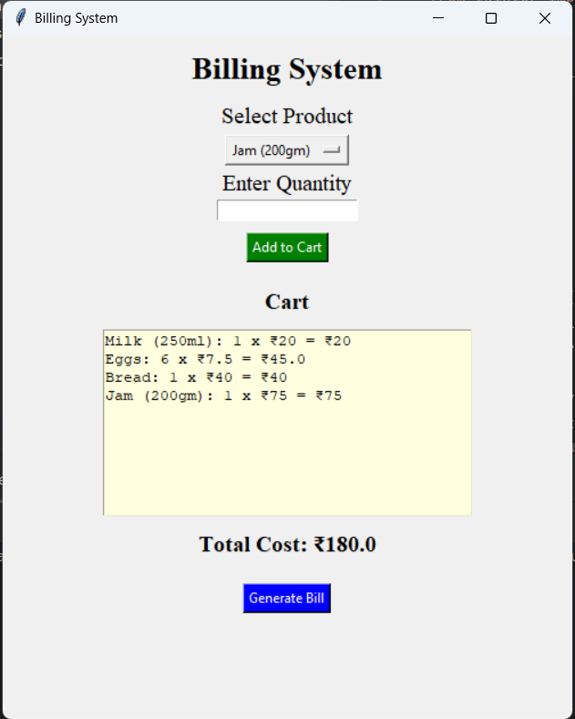
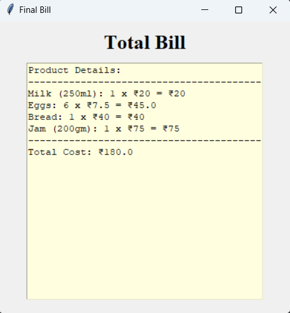

## Billing System

### Overview
The **Billing System** is a Python-based project that generates a bill of the products purchased. This system allows user to select products and quantity, then it calculates total bill for the products purchased, and generates a detailed bill.

### Technologies Used
- **Python:** Core programming language for logic building and calculations.
- **Tkinter:** For building the graphical user interface (GUI).

### Output:

  
