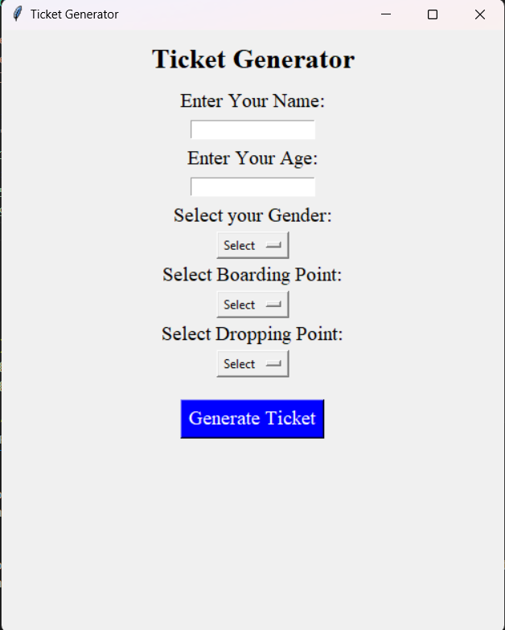
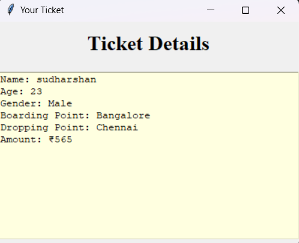

## Ticket Generator

### Overview
The **Ticket Generator** is a Python-based GUI project that enables users to generate travel tickets quickly and easily. The interface provides the following features:

**User Inputs:**
**Name:** Input the passenger's full name.
**Age:** Input the passenger's age.
**Gender:** Select the gender from a dropdown menu.
**Boarding Point:** Choose the location where the journey starts.
**Dropping Point:** Choose the destination where the journey ends.
**Generate Ticket Button:** Upon clicking the Generate Ticket button, the system generates a detailed ticket with the entered details.

### Technologies Used
- **Python:** Core programming language for logic building and calculations.
- **Tkinter:** Python Library for building the graphical user interface (GUI).

### Output:

  
