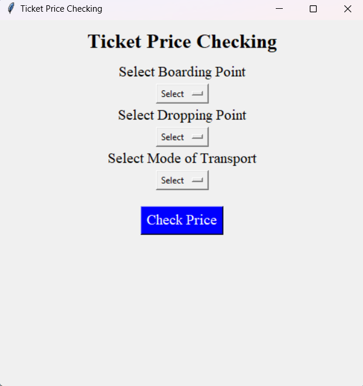
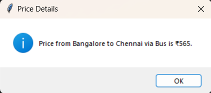

## Ticket Price Checking

### Overview

The **Ticket Price Checking** is a Python-based GUI application that enables users to estimate the cost of a journey based on selected parameters. The interface provides the following features:

**User Inputs:**
**Boarding Point:** Choose the starting location of the journey.
**Dropping Point:** Choose the destination of the journey.
**Mode of Transport:** Select the mode of transport (e.g., bus, train, flight) from the dropdown menu.
**Check Price Button:** Once the Check Price button is clicked, the system calculates and displays the estimated ticket price based on the selected parameters.

### Technologies Used
- **Python:** Core programming language for logic building and calculations.
- **Tkinter:** Python Library for building the graphical user interface (GUI).

### Output:

  
